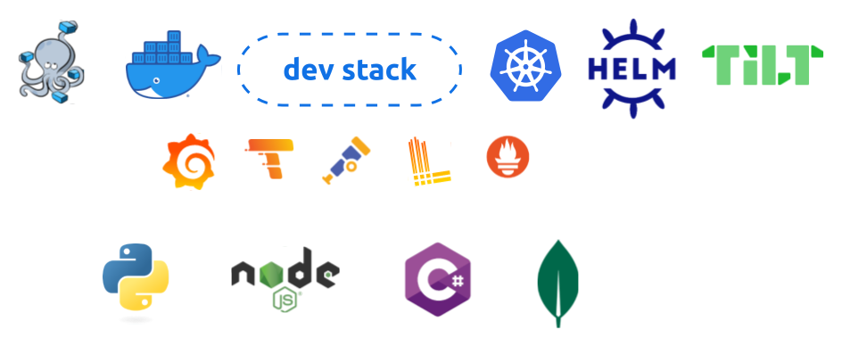

Configs and setup for running the services locally.

## Secrets

1. Create new or obtain existing Reddit credentials (required by the [dispatcher](https://github.com/flam-flam/dispatcher-service))
2. Create a `.env` file ([example](./example.env)):
    ```env
    REDDIT_CLIENT_ID=<value>
    REDDIT_CLIENT_SECRET=<value>
    MONGO_INITDB_ROOT_USERNAME=<value>
    MONGO_INITDB_ROOT_PASSWORD=<value>
    MONGO_CONNECTION_STRING=<value>
    DISPATCHER_BRANCH=main
    COMMENT_BRANCH=main
    SUBMISSION_BRANCH=main
    ```

## Docker compose

### Prerequisites
docker version `>=23.0.0`

#### Usage

Run the services in docker:
```bash
make up
```

## Tilt

### Prerequisites

[Tilt `>=v0.32.0`](https://docs.tilt.dev/install.html)

#### Steps:

Run tilt:
```bash
cd tilt
tilt up
```

Note that `Tiltfile` references the helm chart and the docker build path
locally for now, so please make sure the `dispatcher-service` and
`helm-charts` repos are pulled at the same level as this repo.
